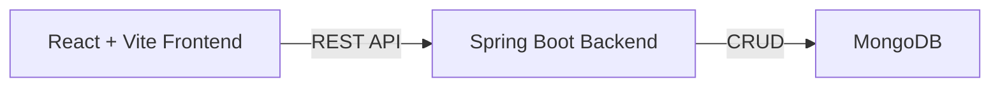

# ToolVerse — AI Tools Discovery Platform

A premium, Apple-inspired AI tools discovery frontend + Spring Boot + MongoDB backend.

---

## Architecture Overview



| Layer | Tech | Purpose |
|-------|------|---------|
| Frontend | React 18, Vite, Tailwind CSS, shadcn/ui, Framer Motion, Lucide Icons | Premium UI |
| Backend | Spring Boot 3, Spring Data MongoDB, Spring Web | REST API |
| Database | MongoDB | Document store for tools, categories, requests |

---

## User Review Required

> [!IMPORTANT]
> **Stack confirmation**: You asked for **React + Spring Boot + MongoDB**. The frontend Vite project is already scaffolded at `d:\Step\Frontend`. The Spring Boot backend will be created at `d:\Step\Backend`. Please confirm this folder layout.

> [!IMPORTANT]
> **MongoDB**: I'll assume MongoDB is already installed and running locally on the default port (`27017`). The database will be named `toolverse`. Please confirm or provide connection details.

> [!WARNING]
> **shadcn/ui + Tailwind**: The user requested shadcn/ui which requires Tailwind CSS. I'll install **Tailwind CSS v3** (stable with shadcn) and configure shadcn/ui accordingly. This means the project uses Tailwind despite it not being the default recommendation — but the user explicitly requested it.

---

## Proposed Changes

### 1. Frontend — `d:\Step\Frontend`

#### Folder Structure

```
Frontend/
├── public/
├── src/
│   ├── assets/                  # Static assets, noise textures, etc.
│   ├── components/
│   │   ├── ui/                  # shadcn/ui components (Button, Input, Badge, Card, Tabs, Dialog, etc.)
│   │   ├── layout/
│   │   │   ├── Navbar.jsx       # Top navigation bar
│   │   │   └── Footer.jsx       # Minimal footer
│   │   ├── hero/
│   │   │   └── HeroSection.jsx  # Hero with headline, search bar, trust line
│   │   ├── search/
│   │   │   ├── SearchBar.jsx    # Intelligent search input
│   │   │   ├── SearchResults.jsx # Animated grid of tool cards
│   │   │   ├── FilterChips.jsx  # Free, Paid, Popular, New, etc.
│   │   │   └── ToolCard.jsx     # Premium glassmorphism tool card
│   │   ├── categories/
│   │   │   └── CategorySection.jsx  # Stylish category chips
│   │   ├── featured/
│   │   │   └── FeaturedTools.jsx    # Trending, New, Best Free sections
│   │   ├── request/
│   │   │   └── RequestTool.jsx      # Request a missing tool form
│   │   ├── admin/
│   │   │   └── AdminDashboard.jsx   # Admin tool management
│   │   └── common/
│   │       ├── LoadingSkeleton.jsx
│   │       ├── EmptyState.jsx
│   │       └── GlowBackground.jsx   # Animated gradient blobs
│   ├── pages/
│   │   ├── HomePage.jsx
│   │   ├── ToolDetailPage.jsx
│   │   ├── CategoriesPage.jsx
│   │   ├── RequestsPage.jsx
│   │   ├── AdminPage.jsx
│   │   └── AboutPage.jsx
│   ├── hooks/
│   │   ├── useTools.js          # Fetch/search tools
│   │   ├── useCategories.js     # Fetch categories
│   │   └── useBookmarks.js      # Local bookmark state
│   ├── services/
│   │   └── api.js               # Axios instance + API calls
│   ├── data/
│   │   └── mockTools.js         # Seed/mock data for initial demo
│   ├── lib/
│   │   └── utils.js             # shadcn utility (cn function)
│   ├── App.jsx
│   ├── index.css                # Tailwind directives + custom styles
│   └── main.jsx
├── components.json              # shadcn/ui config
├── tailwind.config.js
├── postcss.config.js
├── jsconfig.json                # Path aliases
└── package.json
```

#### Key Frontend Deliverables

| Component | Description |
|-----------|-------------|
| **Navbar** | Logo, nav links (Explore, Categories, Requests, Pricing, About), Login/Sign Up, theme toggle |
| **HeroSection** | Large headline, subheadline, centered search bar, trust line |
| **SearchBar** | Debounced search, animated placeholder, search icon |
| **ToolCard** | Glassmorphism card with name, description, tags, Free/Paid badge, credits, CTA buttons |
| **SearchResults** | Animated grid with Framer Motion stagger, loading skeletons |
| **FilterChips** | Free, Paid, Popular, New, Most Credits, Trending toggles |
| **CategorySection** | Stylish category chips that filter tools |
| **FeaturedTools** | Three sections: Trending Today, New This Week, Best Free Tools |
| **RequestTool** | Form (tool idea, problem, category, email) + empty state |
| **ToolDetailPage** | Full tool view with tabs: Overview, Pricing, Credits, Reviews, Alternatives |
| **AdminDashboard** | Add/edit tools, manage status (pending/approved/featured) |
| **GlowBackground** | Animated gradient blobs + noise texture |
| **Footer** | Product links, categories, social, copyright |

#### Design System

- **Colors**: Dark base (`#0a0a0f`), accents in blue (`#3b82f6`), violet (`#8b5cf6`), cyan (`#06b6d4`), soft whites
- **Typography**: Inter font from Google Fonts
- **Cards**: `backdrop-blur`, semi-transparent backgrounds, subtle borders, `rounded-2xl`
- **Animations**: Framer Motion for page transitions, card hover lift, stagger reveals
- **Spacing**: Consistent `p-6`, `gap-6`, `space-y-8` rhythm

---

### 2. Backend — `d:\Step\Backend`

#### [NEW] Spring Boot project structure

```
Backend/
├── src/main/java/com/toolverse/
│   ├── ToolverseApplication.java
│   ├── config/
│   │   ├── CorsConfig.java          # CORS for frontend
│   │   └── MongoConfig.java         # MongoDB configuration
│   ├── model/
│   │   ├── Tool.java                # Main tool document
│   │   ├── Category.java            # Category document
│   │   ├── ToolRequest.java         # User-submitted tool requests
│   │   └── enums/
│   │       ├── PricingModel.java    # FREE, FREEMIUM, PAID
│   │       └── ToolStatus.java      # PENDING, APPROVED, FEATURED
│   ├── repository/
│   │   ├── ToolRepository.java
│   │   ├── CategoryRepository.java
│   │   └── ToolRequestRepository.java
│   ├── service/
│   │   ├── ToolService.java
│   │   ├── CategoryService.java
│   │   └── ToolRequestService.java
│   ├── controller/
│   │   ├── ToolController.java
│   │   ├── CategoryController.java
│   │   └── ToolRequestController.java
│   └── dto/
│       ├── ToolDTO.java
│       └── ToolRequestDTO.java
├── src/main/resources/
│   ├── application.yml
│   └── data/
│       └── seed-tools.json          # Initial seed data
├── pom.xml
└── README.md
```

#### MongoDB Models

**Tool Document:**
```json
{
  "id": "string",
  "name": "ChatGPT",
  "description": "AI chatbot for conversation and content generation",
  "category": "Writing",
  "tags": ["chatbot", "writing", "content"],
  "pricingModel": "FREEMIUM",
  "isFree": true,
  "dailyCredits": 50,
  "creditUnit": "messages",
  "primaryUseCase": "Content generation & conversation",
  "websiteUrl": "https://chat.openai.com",
  "logoUrl": "...",
  "pros": ["Fast responses", "Versatile"],
  "limitations": ["May hallucinate", "Context window limits"],
  "alternatives": ["Claude", "Gemini"],
  "status": "APPROVED",
  "featured": false,
  "trending": true,
  "createdAt": "2026-04-07T00:00:00Z",
  "updatedAt": "2026-04-07T00:00:00Z"
}
```

**ToolRequest Document:**
```json
{
  "id": "string",
  "toolIdea": "AI-powered resume builder",
  "problemItSolves": "Creating professional resumes quickly",
  "desiredCategory": "Productivity",
  "email": "user@example.com",
  "status": "PENDING",
  "createdAt": "2026-04-07T00:00:00Z"
}
```

#### REST API Endpoints

| Method | Endpoint | Description |
|--------|----------|-------------|
| `GET` | `/api/tools` | List all tools (with pagination) |
| `GET` | `/api/tools/search?q=` | Search tools by name/description |
| `GET` | `/api/tools/{id}` | Get tool details |
| `GET` | `/api/tools/category/{category}` | Filter by category |
| `GET` | `/api/tools/featured` | Get featured/trending tools |
| `POST` | `/api/tools` | Admin: Create a tool |
| `PUT` | `/api/tools/{id}` | Admin: Update a tool |
| `DELETE` | `/api/tools/{id}` | Admin: Delete a tool |
| `GET` | `/api/categories` | List all categories |
| `POST` | `/api/requests` | Submit a tool request |
| `GET` | `/api/requests` | Admin: View all requests |
| `PUT` | `/api/requests/{id}` | Admin: Update request status |

---

## Build Order

### Phase 1: Backend Foundation
1. Generate Spring Boot project with Spring Web, Spring Data MongoDB, Lombok, Validation
2. Create MongoDB models (Tool, Category, ToolRequest)
3. Create repositories
4. Create services with search logic
5. Create REST controllers
6. Add CORS config for `http://localhost:5173`
7. Seed initial tool data (15-20 real AI tools)
8. Test endpoints

### Phase 2: Frontend Foundation
1. Install Tailwind CSS, shadcn/ui, Framer Motion, Lucide React, Axios, React Router
2. Configure Tailwind with custom dark theme
3. Set up shadcn/ui components
4. Create design system (index.css, GlowBackground)
5. Build layout (Navbar + Footer)

### Phase 3: Frontend Core Pages
1. Build HeroSection with SearchBar
2. Build ToolCard + SearchResults grid
3. Build CategorySection
4. Build FeaturedTools section
5. Build HomePage assembly

### Phase 4: Additional Pages
1. Build ToolDetailPage with tabs
2. Build RequestTool form + empty state
3. Build AdminDashboard
4. Build CategoriesPage, AboutPage

### Phase 5: Polish & Integration
1. Wire up all API calls via services/api.js
2. Add loading skeletons, empty states
3. Add Framer Motion animations everywhere
4. Add filter chips + bookmark functionality
5. Responsive design pass
6. Final polish

---

## Verification Plan

### Automated Tests
- `mvn spring-boot:run` — Verify backend starts without errors
- `npm run dev` — Verify frontend starts without errors
- Test all API endpoints via browser/curl

### Manual Verification
- Open `http://localhost:5173` in browser
- Verify all sections render correctly
- Test search, filtering, category navigation
- Test tool detail page with tabs
- Test request form submission
- Test admin dashboard CRUD
- Verify responsive design on different viewports
- Verify animations and transitions

---

## Open Questions

> [!IMPORTANT]
> 1. **MongoDB**: Is MongoDB installed and running locally on port 27017? Or should I provide Docker setup?
> 2. **Authentication**: The original spec mentions Login/Sign Up buttons and an admin dashboard. Should I implement actual auth (JWT), or just UI-only for now?
> 3. **Folder layout**: Frontend at `d:\Step\Frontend`, Backend at `d:\Step\Backend` — is this acceptable?
